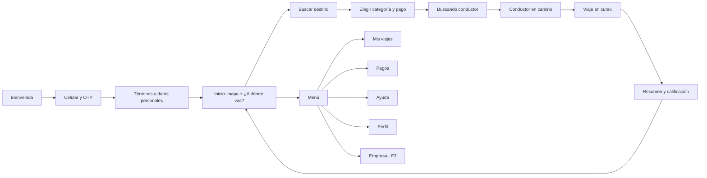

# 04 · App Pasajero (PWA)

## Resumen

| | |
|---|---|
| **Usuarios** | Pasajeros, empleados de empresas cliente y administradores corporativos |
| **Plataforma** | PWA móvil, instalable en la pantalla de inicio; también usable desde el navegador |
| **Prioridad de diseño** | Pedir un viaje en el menor número de pasos posible, con precio claro antes de confirmar |
| **Navegadores objetivo** | Chrome en Android 9+ y Safari en iOS 16.4+ (ver [RNF](11-requisitos-no-funcionales.md)) |

## Funcionalidades

| Código | Funcionalidad | Fase |
|---|---|---|
| **Cuenta** | | |
| PAS-01 | Registro e inicio de sesión con número celular (+57) y código OTP por SMS o WhatsApp | MVP |
| PAS-02 | Aceptación de términos y **autorización de tratamiento de datos personales** (Ley 1581 de 2012) | MVP |
| PAS-03 | Perfil: nombre, foto opcional, correo para recibos, contactos de confianza | MVP |
| PAS-04 | Lugares guardados (casa, trabajo, favoritos) | MVP |
| PAS-05 | Eliminar cuenta y descargar mis datos | MVP |
| **Métodos de pago** | | |
| PAS-10 | Efectivo como método por defecto | MVP |
| PAS-11 | Agregar, quitar y elegir tarjeta (formulario de la pasarela; TransporteYa solo guarda el token) | MVP |
| PAS-12 | Métodos locales (Nequi, PSE, Bre-B u otros según la pasarela) | F2 |
| PAS-13 | Ver y pagar deudas pendientes (cobros fallidos, pasajero ausente) | MVP |
| **Pedir un viaje** | | |
| PAS-20 | Origen por GPS con ajuste del pin en el mapa | MVP |
| PAS-21 | Búsqueda de destino con autocompletado que entiende direcciones colombianas (`Cra 7 # 32-16`), lugares y recientes | MVP |
| PAS-22 | Elegir categoría con precio estimado, ETA de recogida y aviso de dinámica | MVP |
| PAS-23 | Nota para el conductor (por ejemplo, "portería 2") | MVP |
| PAS-24 | Confirmar viaje y ver el estado de la búsqueda de conductor | MVP |
| PAS-25 | Programar viaje para una fecha y hora futura | F2 |
| PAS-26 | Viaje intermunicipal o nacional: elegir destino de la lista de rutas con tarifa fija, `solo ida` o `ida y vuelta`, con el valor visible antes de confirmar | MVP |
| **Durante el viaje** | | |
| PAS-30 | Ver conductor asignado: nombre, foto, calificación, vehículo, color y **placa** | MVP |
| PAS-31 | Seguimiento en vivo del conductor y ETA actualizado | MVP |
| PAS-32 | Chat con el conductor | MVP |
| PAS-33 | PIN de inicio de viaje | MVP |
| PAS-34 | Compartir viaje con un enlace temporal | MVP |
| PAS-35 | Botón **SOS** con opción de llamar al 123 | MVP |
| PAS-36 | Cancelar viaje con aviso del costo según el momento | MVP |
| PAS-37 | Cambiar destino y agregar paradas, con nuevo precio | F2 |
| PAS-38 | Llamada enmascarada al conductor | F2 |
| **Después del viaje** | | |
| PAS-40 | Resumen: recorrido, tiempo, desglose del precio y método de pago | MVP |
| PAS-41 | Calificar al conductor con estrellas, etiquetas y comentario | MVP |
| PAS-42 | Propina electrónica | MVP |
| PAS-43 | Recibo por correo y descarga en PDF | MVP |
| PAS-44 | Historial de viajes con filtros | MVP |
| **Soporte** | | |
| PAS-50 | Reportar un problema sobre un viaje específico | MVP |
| PAS-51 | Reportar objeto perdido | MVP |
| PAS-52 | Radicar PQRS y consultar su estado | F2 |
| **Corporativo** | | |
| PAS-60 | Vincular el perfil a una empresa por invitación | F3 |
| PAS-61 | Elegir perfil personal o corporativo al pedir; elegir centro de costo y motivo | F3 |
| PAS-62 | Sección **Empresa** para administradores: empleados, centros de costo, políticas, viajes y estados de cuenta | F3 |
| **Notificaciones** | | |
| PAS-70 | Push: conductor asignado, conductor llegó, viaje finalizado, recordatorios de reserva, respuestas de soporte | MVP |

## Pantallas principales

## Historias de usuario clave

### HU-PAS-01 · Pedir un viaje inmediato

**Como** pasajero **quiero** pedir un viaje indicando solo el destino **para** moverme rápido sin negociar el precio.

- **Dado** que tengo la ubicación activa, **cuando** abro la app, **entonces** el origen se llena con mi ubicación y puedo ajustar el pin.
- **Dado** que elegí un destino, **cuando** veo las categorías, **entonces** cada una muestra precio estimado, ETA de recogida y, si aplica, el aviso de dinámica.
- **Dado** que confirmo, **cuando** un conductor acepta, **entonces** veo su nombre, foto, calificación, vehículo y placa en menos de `[2 s]` desde la aceptación.
- **Dado** que nadie acepta en `[2 min]`, **entonces** veo un mensaje claro y puedo reintentar sin volver a escribir el destino.

### HU-PAS-02 · Cancelar un viaje

**Como** pasajero **quiero** saber cuánto me cuesta cancelar antes de hacerlo **para** no llevarme sorpresas.

- **Dado** que estoy dentro del periodo gratuito (RN-042), **cuando** toco "Cancelar", **entonces** la app indica que no tiene costo.
- **Dado** que el periodo gratuito terminó, **cuando** toco "Cancelar", **entonces** la app muestra el valor de la tarifa de cancelación y pide confirmación.

### HU-PAS-03 · Emergencia durante el viaje

**Como** pasajero **quiero** pedir ayuda con un solo gesto **para** sentirme seguro.

- **Dado** que estoy en un viaje, **cuando** mantengo presionado el botón SOS `[2 s]`, **entonces** se genera una alerta crítica en la torre de control con mi ubicación en vivo y la app me ofrece llamar al 123.
- **Dado** que tengo contactos de confianza, **cuando** activo el SOS, **entonces** ellos reciben un mensaje con el enlace del viaje.

### HU-PAS-04 · Pagar con tarjeta

**Como** pasajero **quiero** que el viaje se cobre automáticamente a mi tarjeta **para** no tener que manejar efectivo.

- **Dado** que agregué una tarjeta, **cuando** termina el viaje, **entonces** se cobra el valor final y recibo el recibo por correo.
- **Dado** que el cobro falla, **entonces** la app me muestra la deuda y no me permite pedir otro viaje hasta pagarla con otro método.

## Consideraciones de la PWA

- **Instalación:** invitar a instalar la app después del primer viaje completado, no al entrar.
- **iOS:** las notificaciones push solo funcionan si la PWA está **instalada** en la pantalla de inicio
  (iOS 16.4 o superior). La app debe explicarlo y, sin push, apoyarse en la conexión en tiempo real
  mientras está abierta.
- **Sin conexión:** la interfaz base, el historial y los lugares guardados se guardan en caché.
  Pedir un viaje exige conexión; si se pierde durante el viaje, la app se reconecta y recupera el estado.
- **Ubicación:** pedir el permiso solo al momento de fijar el origen, explicando para qué se usa.
- **Datos móviles:** mapas vectoriales en caché y actualizaciones de posición del conductor limitadas
  a lo necesario para no consumir el plan del usuario.
