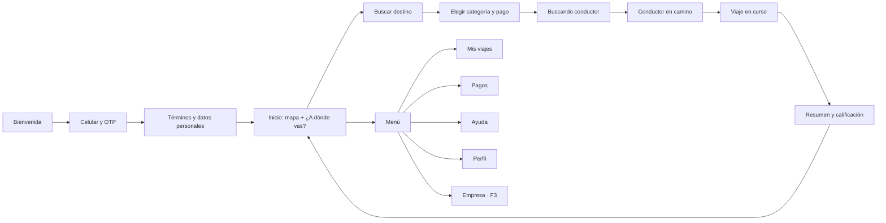

# 04 · App Pasajero (PWA)

## Resumen

| | |
|---|---|
| **Usuarios** | Pasajeros, empleados de empresas cliente y administradores corporativos |
| **Plataforma** | PWA móvil, instalable en la pantalla de inicio; también usable desde el navegador |
| **Prioridad de diseño** | Pedir un viaje en el menor número de pasos posible, con precio claro antes de confirmar |
| **Navegadores objetivo** | Chrome en Android 9+ y Safari en iOS 16.4+ (ver [RNF](11-requisitos-no-funcionales.md)) |

## Funcionalidades

| Código | Funcionalidad | Fase |
|---|---|---|
| **Cuenta** | | |
| PAS-01 | Registro e inicio de sesión con número celular (+57) y código OTP por SMS o WhatsApp | MVP |
| PAS-02 | Aceptación de términos y **autorización de tratamiento de datos personales** (Ley 1581 de 2012) | MVP |
| PAS-03 | Perfil: nombre, foto opcional, correo para recibos, contactos de confianza | MVP |
| PAS-04 | Lugares guardados (casa, trabajo, favoritos) | MVP |
| PAS-05 | Eliminar cuenta y descargar mis datos | MVP |
| **Métodos de pago** | | |
| PAS-10 | Efectivo como método por defecto | MVP |
| PAS-11 | Agregar, quitar y elegir tarjeta (formulario de la pasarela; TransporteYa solo guarda el token) | MVP |
| PAS-12 | Métodos locales (Nequi, PSE, Bre-B u otros según la pasarela) | F2 |
| PAS-13 | Ver y pagar deudas pendientes (cobros fallidos, pasajero ausente) | MVP |
| **Pedir un viaje** | | |
| PAS-20 | Origen por GPS con ajuste del pin en el mapa | MVP |
| PAS-21 | Búsqueda de destino con autocompletado que entiende direcciones colombianas (`Cra 7 # 32-16`), lugares y recientes | MVP |
| PAS-22 | Elegir categoría con precio estimado, ETA de recogida y aviso de dinámica | MVP |
| PAS-23 | Nota para el conductor (por ejemplo, "portería 2") | MVP |
| PAS-24 | Confirmar viaje y ver el estado de la búsqueda de conductor | MVP |
| PAS-25 | Programar viaje para una fecha y hora futura (entre 45 min y 7 días), con precio cerrado; ver, abrir y cancelar mis reservas | MVP · hecho |
| PAS-26 | Viaje intermunicipal o nacional: elegir destino de la lista de rutas con tarifa fija, `solo ida` o `ida y vuelta`, con el valor visible antes de confirmar | MVP |
| **Durante el viaje** | | |
| PAS-30 | Ver conductor asignado: nombre, foto, calificación, vehículo, color y **placa** | MVP |
| PAS-31 | Seguimiento en vivo del conductor y ETA actualizado | MVP |
| PAS-32 | Chat con el conductor | MVP |
| PAS-33 | PIN de inicio de viaje | MVP |
| PAS-34 | Compartir viaje con un enlace temporal | MVP |
| PAS-35 | Botón **SOS** con opción de llamar al 123 | MVP |
| PAS-36 | Cancelar viaje con aviso del costo según el momento | MVP |
| PAS-37 | Cambiar destino y agregar paradas, con nuevo precio | F2 |
| PAS-38 | Llamada enmascarada al conductor | F2 |
| **Después del viaje** | | |
| PAS-40 | Resumen: recorrido, tiempo, desglose del precio y método de pago | MVP |
| PAS-41 | Calificar al conductor con estrellas, etiquetas y comentario | MVP |
| PAS-42 | Propina electrónica | MVP |
| PAS-43 | Recibo por correo y descarga en PDF | MVP |
| PAS-44 | Historial de viajes con filtros | MVP |
| **Soporte** | | |
| PAS-50 | Reportar un problema sobre un viaje específico | MVP |
| PAS-51 | Reportar objeto perdido | MVP |
| PAS-52 | Radicar PQRS y consultar su estado | F2 |
| **Corporativo** | | |
| PAS-60 | Vincular el perfil a una empresa por invitación (llega al celular, se acepta en Cuenta → «Mi empresa»; se puede salir de la empresa) | F3 · hecho |
| PAS-61 | Elegir perfil personal o corporativo al pedir («Empresa · nombre» entre las formas de pago); elegir centro de costo y motivo; la política avisa antes de confirmar | F3 · hecho |
| PAS-62 | Sección **Empresa** para administradores: empleados, centros de costo, políticas, viajes y estados de cuenta. Por D-09 vive en la **App Operación** («Mi empresa»), no en esta app | F3 · hecho en Operación |
| **Notificaciones** | | |
| PAS-70 | Push: conductor asignado, conductor llegó, viaje finalizado, recordatorios de reserva, respuestas de soporte | MVP |

## Pantallas principales

## Historias de usuario clave

### HU-PAS-01 · Pedir un viaje inmediato

**Como** pasajero **quiero** pedir un viaje indicando solo el destino **para** moverme rápido sin negociar el precio.

- **Dado** que tengo la ubicación activa, **cuando** abro la app, **entonces** el origen se llena con mi ubicación y puedo ajustar el pin.
- **Dado** que elegí un destino, **cuando** veo las categorías, **entonces** cada una muestra precio estimado, ETA de recogida y, si aplica, el aviso de dinámica.
- **Dado** que confirmo, **cuando** un conductor acepta, **entonces** veo su nombre, foto, calificación, vehículo y placa en menos de `[2 s]` desde la aceptación.
- **Dado** que nadie acepta en `[2 min]`, **entonces** veo un mensaje claro y puedo reintentar sin volver a escribir el destino.

### HU-PAS-02 · Cancelar un viaje

**Como** pasajero **quiero** saber cuánto me cuesta cancelar antes de hacerlo **para** no llevarme sorpresas.

- **Dado** que estoy dentro del periodo gratuito (RN-042), **cuando** toco "Cancelar", **entonces** la app indica que no tiene costo.
- **Dado** que el periodo gratuito terminó, **cuando** toco "Cancelar", **entonces** la app muestra el valor de la tarifa de cancelación y pide confirmación.

### HU-PAS-03 · Emergencia durante el viaje

**Como** pasajero **quiero** pedir ayuda con un solo gesto **para** sentirme seguro.

- **Dado** que estoy en un viaje, **cuando** mantengo presionado el botón SOS `[2 s]`, **entonces** se genera una alerta crítica en la torre de control con mi ubicación en vivo y la app me ofrece llamar al 123.
- **Dado** que tengo contactos de confianza, **cuando** activo el SOS, **entonces** ellos reciben un mensaje con el enlace del viaje.

### HU-PAS-04 · Pagar con tarjeta

**Como** pasajero **quiero** que el viaje se cobre automáticamente a mi tarjeta **para** no tener que manejar efectivo.

- **Dado** que agregué una tarjeta, **cuando** termina el viaje, **entonces** se cobra el valor final y recibo el recibo por correo.
- **Dado** que el cobro falla, **entonces** la app me muestra la deuda y no me permite pedir otro viaje hasta pagarla con otro método.

## Marca y movimiento

> **Implementado**, y común a las tres apps (componentes en `packages/ui`).

- **Pantalla de arranque:** al abrir la app (una vez por sesión del navegador, es decir, cada vez que se abre la app instalada) el carro llega a toda velocidad, la burbuja del logo se arma a su alrededor, el carro pasa a ser la «ventana» del logo, aparece el nombre y el carro sale disparado por la derecha. Dura unos 2,7 s, se salta tocando la pantalla o con cualquier tecla, y va encima de la app, que ya está cargando por debajo. Con «reducir movimiento» activado en el sistema se ve el logo ya armado durante un instante y se va.
- **Pantallas de ingreso:** el logo se arma (sin la salida del carro) y queda flotando suave.
- **Carga:** donde antes había un círculo giratorio a pantalla completa, ahora el carro de la marca salta sobre la ruta con las líneas de velocidad (`CargandoCarro`, `PantallaCargando`). Los botones conservan su indicador pequeño.
- **Cambio de pantalla:** cada pantalla aparece con un desvanecido corto (`EntradaPagina`). Es solo opacidad a propósito: un movimiento volvería relativos al contenedor los elementos fijos de la pantalla mientras dura.
- **Cómo se ve o se prueba:** abrir cualquier app con `?splash` en la dirección fuerza la pantalla de arranque; el navegador automatizado de las pruebas no la muestra sola.
- **Piezas:** el logo está dibujado en vectores (`marca/geometria.ts`, medido sobre el PNG) para animar la burbuja, el carro, las ruedas y las líneas por separado; los PNG siguen siendo el logo oficial estático.

## Consideraciones de la PWA

- **Instalación:** la tarjeta «Instala TransporteYa en tu teléfono» (Cuenta) abre el cuadro de instalación en Android y explica los pasos en iPhone, donde Safari no permite instalar con un botón. Queda pendiente invitar también tras el primer viaje completado.
- **Probar en un teléfono real:** [guía](16-pruebas-en-telefono.md) (`pnpm movil`).
- **iOS:** las notificaciones push solo funcionan si la PWA está **instalada** en la pantalla de inicio
  (iOS 16.4 o superior). La app debe explicarlo y, sin push, apoyarse en la conexión en tiempo real
  mientras está abierta.
- **Sin conexión:** la interfaz base se guarda en el teléfono (service worker): la app abre sin internet y una franja avisa «Sin conexión: reintentando…» y «Conexión recuperada». El historial y los lugares guardados salen del servidor, así que no se ven sin conexión (pendiente).
  Pedir un viaje exige conexión; si se pierde durante el viaje, la app se reconecta y recupera el estado.
- **Diagnóstico:** `/diagnostico` muestra qué permite el teléfono (HTTPS, instalación, sin conexión, ubicación, pantalla encendida, vibración, sonido) y copia un informe.
- **Ubicación:** pedir el permiso solo al momento de fijar el origen, explicando para qué se usa.
- **Datos móviles:** mapas vectoriales en caché y actualizaciones de posición del conductor limitadas
  a lo necesario para no consumir el plan del usuario.

## Estado de la implementación

La app está construida y probada de punta a punta en **modo demostración** (ver [D-25 y D-26](13-decisiones-pendientes-y-riesgos.md)):
un pasajero nuevo pide un viaje, un conductor simulado lo atiende de verdad, el pasajero lo sigue en vivo, paga y califica.
Código en `apps/pasajero`; la prueba con navegador real está en `apps/e2e`.

| Pantalla | Qué hace |
|---|---|
| **Entrar** y **Bienvenida** | Celular + código (simulado), nombre y **autorización de datos** (PAS-01, PAS-02). Sin aceptar no se puede pedir |
| **Inicio** | Mapa, "te recogemos en…" con la ubicación del teléfono (solo se pide al fijar la recogida, PAS-20), "¿A dónde vas?", Casa y Trabajo, recientes y viajes a otras ciudades |
| **Buscar destino** | Lugares y barrios (sin importar tildes), direcciones al estilo colombiano (`Cra 23 # 62-14`, marcadas como aproximadas), lugares guardados y recientes (PAS-21) |
| **Cotizar** | Tres categorías con rango de precio, recargo de categoría, tiempo de llegada y aviso de dinámica; efectivo o tarjeta; nota para el conductor; «Ahora» o **reservar para más tarde** (PAS-22, PAS-23, PAS-25) |
| **Cuenta → Mi empresa** | Las invitaciones de empresas (aceptar o rechazar) y la empresa a la que pertenece la persona, con aviso si su perfil corporativo está suspendido (PAS-60) |
| **Mis reservas** | Las reservas abiertas con su hora y estado («Buscaremos conductor», «Conductor confirmado»…); el detalle muestra el conductor confirmado y permite cancelar, avisando si ya cuesta (RN-084, RN-089). Se entra desde Inicio |
| **Otra ciudad** | Destinos con tarifa fija, solo ida o ida y vuelta, con el valor cerrado antes de confirmar (PAS-26) |
| **Buscando** | Radar sobre la recogida, cuenta regresiva de los 2 minutos y cancelar sin costo. Si nadie acepta, lo explica y deja reintentar sin volver a escribir el destino |
| **Conductor en camino / en viaje** | Mapa con el carro en vivo y el tiempo que falta, **PIN** grande, conductor con calificación, vehículo y **placa**, chat con respuestas rápidas, compartir el viaje, **SOS** (mantener 2 s) y cancelar con el costo claro antes de confirmar (PAS-30 a PAS-36) |
| **Resumen** | Precio final, calificación con etiquetas, propina para viajes con tarjeta y recibo con cada concepto (PAS-40 a PAS-43) |
| **Mis viajes** | Historial con filtros, detalle, recibo (se guarda como PDF desde el navegador), pedir de nuevo y reportar un problema (PAS-44, PAS-50, PAS-51) |
| **Pagos** | Tarjetas (la tarjeta nunca se guarda: solo el token), predeterminada, y pago de la deuda (PAS-10, PAS-11, PAS-13) |
| **Cuenta** | Datos, lugares, contactos de confianza, preferencias, **descargar mis datos** y **eliminar la cuenta** (PAS-03 a PAS-05) |
| **Enlace compartido** (`/c/…`) | Página pública, sin cuenta: conductor, placa, posición y barrio de destino; se apaga al terminar el viaje (PAS-34) |

**Cobros rechazados (HU-PAS-04).** Si el banco rechaza la tarjeta al terminar, el viaje queda como **deuda del pasajero**, el conductor cobra igual
y el pasajero no puede pedir otro viaje hasta pagarla con otra tarjeta (ver D-30).

> **Datos personales.** Cuenta → «Mis datos y privacidad»: política, descarga de datos, solicitudes con su respuesta y eliminar la cuenta ([doc 15](15-observabilidad-y-privacidad.md)).

**Pendiente.** Buscador de direcciones real y proveedor de mapas definitivo (D-27; el mapa de calles ya está, ADR-0009), ubicación exacta de los destinos pequeños (D-29), proveedor real de OTP,
notificaciones *push* (PAS-70), pago con Wompi real, recibo por correo, recordatorios de reserva por *push*, llamada enmascarada (F2) y el pago corporativo con facturación electrónica a la empresa.

