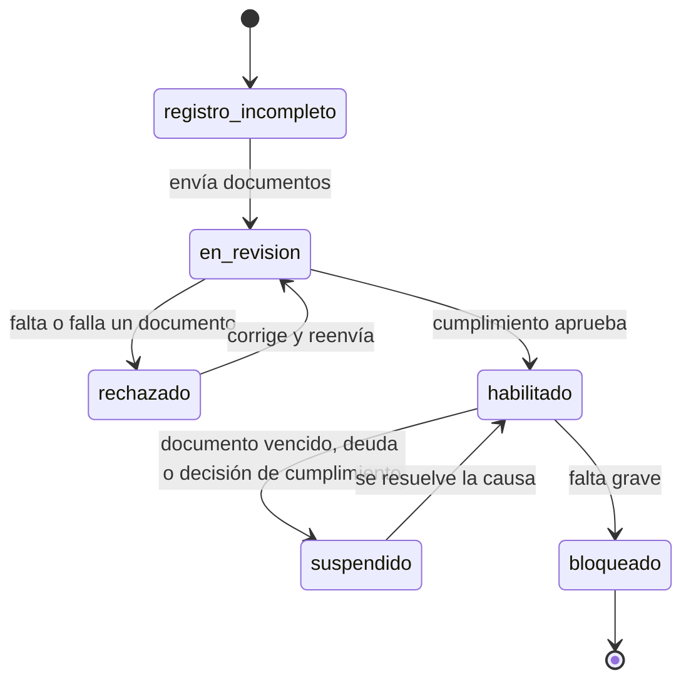
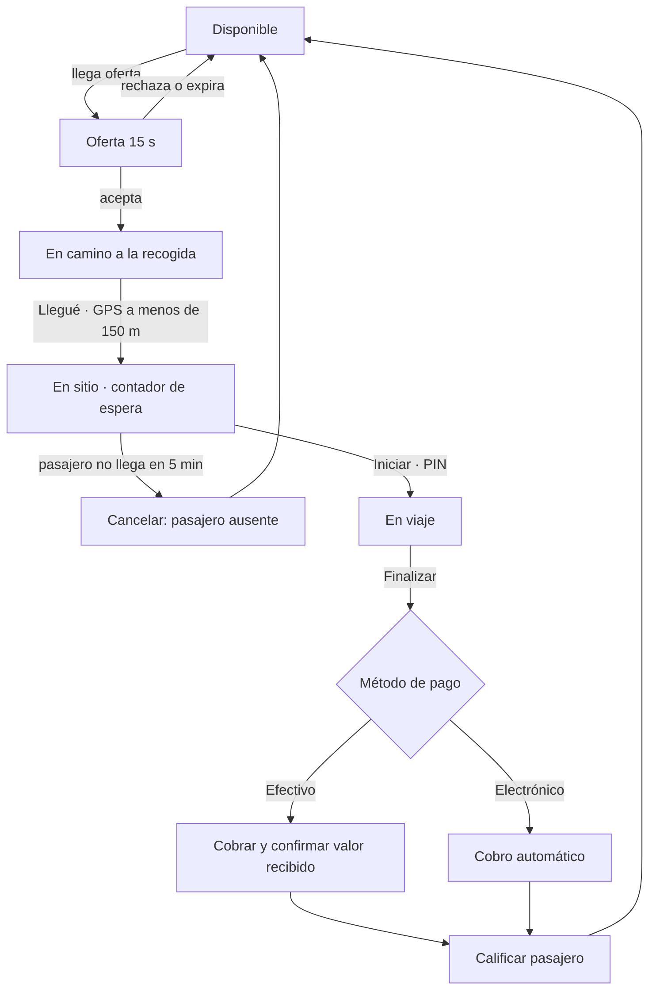

# 05 · App Conductor (PWA)

## Resumen

| | |
|---|---|
| **Usuarios** | Conductores independientes habilitados por TransporteYa |
| **Plataforma** | PWA móvil instalable. **Android es la plataforma prioritaria** |
| **Prioridad de diseño** | Uso con el vehículo en marcha: botones grandes, alto contraste, sonido, mínima lectura |
| **Riesgo principal** | Las PWA no pueden enviar ubicación con la pantalla apagada o la app en segundo plano (ver [ADR-0003](adr/0003-app-conductor-como-pwa.md)) |

## Estados del conductor

Mientras está **habilitado**, el conductor tiene además un **estado operativo**, que es la base para medir sus tiempos:

| Estado operativo | Significado |
|---|---|
| `desconectado` | No recibe ofertas |
| `disponible` | En línea, esperando ofertas |
| `con_oferta` | Tiene una oferta pendiente de responder |
| `en_camino` | Aceptó un viaje y va hacia la recogida |
| `en_sitio` | Llegó al punto de recogida, esperando al pasajero |
| `en_viaje` | Lleva al pasajero |
| `sin_senal` | Estado derivado: no envía ubicación hace más de `[60 s]` |

## Funcionalidades

| Código | Funcionalidad | Fase |
|---|---|---|
| **Registro y habilitación** | | |
| CON-01 | Registro con celular y OTP; autorización de tratamiento de datos | MVP |
| CON-02 | Formulario guiado: datos personales, vehículo y cuenta bancaria | MVP |
| CON-03 | Carga de documentos con la cámara (recorte, legibilidad y fecha de vencimiento) | MVP |
| CON-04 | Estado de la revisión y motivo de rechazo por documento | MVP |
| CON-05 | Alertas de vencimiento y renovación de documentos | MVP |
| CON-06 | Varios vehículos asociados y elección del vehículo activo | F2 |
| **Conexión** | | |
| CON-10 | Conectarse / desconectarse con un solo botón | MVP |
| CON-11 | Al conectarse: verificación de documentos vigentes, permisos de ubicación y sonido, y bloqueo de pantalla activa | MVP |
| CON-12 | Verificación de identidad con selfie aleatoria al conectarse | F2 |
| CON-13 | Aviso de pico y placa del día | F2 |
| CON-14 | Mapa de demanda y zonas con dinámica | F2 |
| **Ofertas y viajes** | | |
| CON-20 | Oferta a pantalla completa con sonido y vibración: recogida, zona de destino, distancia, ganancia estimada, método de pago, calificación del pasajero y contador de `[15 s]` | MVP |
| CON-21 | Aceptar o rechazar la oferta | MVP |
| CON-22 | Navegación en el mapa de la app y botón para abrir **Waze** o **Google Maps** | MVP |
| CON-23 | Botones de estado: **Llegué** (validado por GPS) → **Iniciar** (con PIN si aplica) → **Finalizar** | MVP |
| CON-24 | Contador de espera visible después de "Llegué" | MVP |
| CON-23a | **Taxímetro con GPS**: desde "Iniciar" mide distancia, duración y tiempo detenido, y muestra el valor en curso (RN-015). Acumula sin conexión y envía las mediciones al finalizar | MVP |
| CON-25 | Cancelar con motivo; "pasajero no se presentó" habilitado tras el tiempo de espera | MVP |
| CON-26 | Chat con el pasajero con mensajes rápidos ("Ya llegué", "Estoy en camino") | MVP |
| CON-27 | Al finalizar en efectivo: valor a cobrar en grande y confirmación del valor recibido | MVP |
| CON-28 | Calificar al pasajero | MVP |
| CON-29 | Botón **SOS** | MVP |
| CON-30 | Tablero de reservas programadas: ver, tomar y confirmar | F2 |
| CON-31 | Activar viajes intermunicipales/nacionales y de categoría inferior | MVP |
| **Ganancias** | | |
| CON-40 | Ganancias del día y de la semana; detalle por viaje (tarifa, comisión, propina, peajes) | MVP |
| CON-41 | **Cierre del día**: lo que TransporteYa le debe o la comisión que debe pagar, con los datos de la llave de TransporteYa | MVP |
| CON-42 | Historial de cierres diarios y pagos recibidos | MVP |
| CON-43 | Pagar la comisión desde la app con Bre-B y habilitación automática | F2 |
| **Calidad y soporte** | | |
| CON-50 | Mis indicadores: calificación, tasa de aceptación, tasa de cancelación, horas en línea | MVP |
| CON-51 | Reportar un problema sobre un viaje u objeto encontrado | MVP |
| CON-52 | Centro de ayuda y contacto con soporte | MVP |

## Flujo de un viaje en la app

## Historias de usuario clave

### HU-CON-01 · Recibir una oferta

**Como** conductor **quiero** recibir ofertas con la información suficiente para decidir en pocos segundos.

- **Dado** que estoy disponible y la app está abierta, **cuando** llega una oferta, **entonces** suena una alerta, vibra y la oferta ocupa toda la pantalla con un contador de `[15 s]`.
- **Dado** que no respondo a tiempo, **entonces** la oferta desaparece y sigo disponible.
- **Dado** que acepto, **entonces** veo la ruta a la recogida y el botón para abrir Waze o Google Maps.

### HU-CON-02 · Documentos por vencer

**Como** conductor **quiero** saber con anticipación qué documentos se me vencen **para** no quedar suspendido.

- **Dado** que mi SOAT vence en 15 días, **entonces** recibo una notificación y veo una alerta en la pantalla de inicio.
- **Dado** que mi SOAT venció, **cuando** intento conectarme, **entonces** la app me lo impide y me lleva a cargar el nuevo documento.

### HU-CON-03 · Ver mi saldo

**Como** conductor **quiero** entender cuánto me van a pagar o cuánto debo **para** confiar en la liquidación.

- **Dado** que hice viajes en efectivo y con tarjeta, **cuando** abro Ganancias, **entonces** veo cada movimiento con su signo y el saldo resultante.
- **Dado** que mi deuda supera el límite, **entonces** la app me explica que solo recibiré viajes con pago electrónico hasta bajarla.

## Limitaciones de la PWA y cómo se manejan

Este es el punto técnico más delicado del proyecto. Detalle y alternativa en [ADR-0003](adr/0003-app-conductor-como-pwa.md).

| Limitación | Impacto | Mitigación |
|---|---|---|
| El navegador **no envía ubicación** con la pantalla apagada o la app en segundo plano | El conductor "desaparece" del mapa y no recibe ofertas | Mantener la pantalla encendida con la **Screen Wake Lock API** mientras está en línea; uso recomendado con soporte de celular y cargador; si no hay ubicación en `[60 s]`, el conductor pasa a `sin_senal` y deja de recibir ofertas |
| Sonido bloqueado sin interacción previa | La oferta no suena | El botón "Conectarse" desbloquea el audio; se verifica con un sonido de prueba |
| Notificaciones push en iOS solo con la PWA instalada | Ofertas perdidas en iPhone | Exigir instalación en iOS; Android como plataforma prioritaria |
| El sistema puede cerrar la pestaña por memoria | Desconexión silenciosa | Reconexión automática y recuperación del viaje activo; alerta a operación si un viaje en curso pierde señal |
| Consumo de batería y datos | Abandono de la app | Frecuencia de GPS adaptativa (ver abajo) y mapas en caché |

**Frecuencia de envío de ubicación** (configurable):

| Estado | Intervalo |
|---|---|
| `disponible` | cada `[10 s]` o al moverse `[50 m]` |
| `en_camino`, `en_viaje` | cada `[4 s]` |
| Sin conexión a internet | Se guardan localmente y se envían en lote al reconectar |

**Plan B:** si las pruebas piloto muestran que la PWA pierde demasiadas ubicaciones u ofertas, se empaqueta
la misma aplicación con **Capacitor** para obtener ubicación en segundo plano nativa en Android, sin reescribir la interfaz.
