# 06 · App Operación

## Resumen

| | |
|---|---|
| **Usuarios** | Personal interno: monitores, soporte, cumplimiento, finanzas, supervisores y administradores (ver [roles](02-actores-roles-y-glosario.md#roles-internos-app-operación)) |
| **Plataforma** | Aplicación web para escritorio (pantallas de 1366 px o más); consulta básica desde celular |
| **Acceso** | Solo usuarios internos, con doble factor de autenticación y permisos por rol |
| **Propósito** | Ver y controlar en tiempo real todos los tiempos y movimientos de la operación, y administrar conductores, tarifas, liquidaciones y soporte |

> **Estado de la implementación.** Construidos OPE-01 a OPE-08, OPE-11 y OPE-12 (ver el alcance exacto y lo que falta en la
> decisión D-32 de [docs/13](13-decisiones-pendientes-y-riesgos.md)). Las notas «Implementado» de cada módulo dicen cómo se resolvió
> lo que la especificación dejaba abierto. Los permisos por rol salen de una sola tabla (`packages/dominio/src/permisos.ts`) que usan
> la API (la exige) y la app (oculta lo que la persona no puede hacer).

## Módulos

| Código | Módulo | Fase |
|---|---|---|
| OPE-01 | Torre de control (mapa en vivo, alertas, KPIs del momento) | MVP |
| OPE-02 | Viajes: búsqueda, detalle, línea de tiempo, recorrido, despacho manual | MVP |
| OPE-03 | Tiempos y movimientos: indicadores y reportes | MVP (básico) / F2 (completo) |
| OPE-04 | Conductores y vehículos: onboarding, documentos, vencimientos, suspensiones | MVP |
| OPE-05 | Pasajeros: consulta, deudas y bloqueos | MVP |
| OPE-06 | Tarifas, zonas y dinámica | MVP |
| OPE-07 | Liquidaciones y saldos de conductores | MVP |
| OPE-08 | Soporte y PQRS | MVP (básico) / F2 (completo) |
| OPE-09 | Reservas programadas | F2 |
| OPE-10 | Clientes corporativos | F3 |
| OPE-11 | Usuarios internos, roles y auditoría | MVP |
| OPE-12 | Configuración general y plantillas de notificación | MVP |

---

## OPE-01 · Torre de control

> **Implementado.** Mapa esquemático con zoom y arrastre (flota por estado, viajes con anillo del color del semáforo), indicadores, pestañas de alertas, viajes y sin asignar, y despacho manual con los conductores disponibles ordenados por cercanía. El semáforo sale de los parámetros `semaforo.*`. Se actualiza por `torre:cambio` y las alertas llegan con aviso y sonido.

Pantalla principal del monitor de operación. Se actualiza en vivo (máximo `[3 s]` de retraso).

- **Mapa de flota:** todos los conductores en línea con color por estado operativo
  (disponible, con oferta, en camino, en sitio, en viaje, sin señal). Filtros por categoría, estado y zona.
  Clic en un conductor: ficha rápida, viaje actual, último reporte de ubicación.
- **Viajes activos:** lista con estado, tiempo en el estado actual y semáforo cuando un tiempo supera lo esperado.
- **Solicitudes sin asignar:** viajes buscando conductor, con tiempo transcurrido y botón de despacho manual.
- **Panel de alertas:** ordenado por severidad; cada alerta se **toma**, se **atiende** y se **cierra** con nota.
- **KPIs del momento:** conductores en línea / disponibles, viajes activos, solicitudes de la última hora,
  tiempo medio de asignación, tasa de cancelación del día, demanda insatisfecha.
- **Capas opcionales:** mapa de calor de demanda, celdas con dinámica, zonas y geocercas.

### Alertas automáticas

| Alerta | Condición `[configurable]` | Severidad |
|---|---|---|
| SOS | Pasajero o conductor activa el botón | Crítica |
| Parada no prevista | Vehículo detenido más de `[5 min]` durante un viaje, fuera de origen y destino | Alta |
| Pérdida de señal en viaje | Sin ubicación más de `[60 s]` con un viaje en curso | Alta |
| Desvío de ruta | Más de `[1 km]` o `[30 %]` fuera de la ruta esperada | Media |
| Viaje excedido | Duración mayor a `[2 ×]` la estimada | Media |
| Velocidad excesiva | Más de `[80 km/h]` en zona urbana durante `[30 s]` (F2) | Media |
| Reserva sin conductor | Viaje programado sin conductor a `[15 min]` | Alta |
| Demanda insatisfecha | Más de `[5]` solicitudes sin conductor en una zona en `[10 min]` | Media |
| Cancelaciones repetidas | Conductor con más de `[3]` cancelaciones en `[24 h]` | Baja |
| Documento vencido | Documento obligatorio vencido (el conductor se suspende solo) | Baja |
| Calificación de seguridad | Calificación con etiqueta de seguridad | Alta |

## OPE-02 · Viajes

> **Implementado.** Búsqueda con filtros, detalle con línea de tiempo, ofertas, pagos, chat, tickets y alertas, reproducción del recorrido con el control de avance, y las acciones de reasignar, cancelar, ajustar precio y crear ticket (D-33, D-34).

- **Búsqueda** por código de viaje, pasajero, conductor, placa, fecha, estado, tipo de servicio y método de pago.
- **Detalle del viaje:**
  - datos de pasajero, conductor, vehículo, tarifa (versión, desglose, dinámica, recargos) y pago;
  - **línea de tiempo** con cada evento y su hora exacta: solicitado, cada oferta enviada (a quién, ETA,
    respuesta y tiempo de respuesta), aceptado, llegué, inicio, paradas, fin, pago, calificaciones, tickets;
  - **recorrido GPS** sobre el mapa con reproducción a velocidad ajustable y comparación con la ruta estimada;
  - alertas y notas internas asociadas.
- **Acciones** (según rol): despachar manualmente, reasignar, cancelar con motivo, ajustar la tarifa con
  motivo, crear un ticket.

## OPE-03 · Tiempos y movimientos

> **Implementado (versión básica).** Asignación media, mediana y percentil 90, llegada, espera, duración, tasa de aceptación, utilización de la flota, km productivos, dinero y mezcla de pago, por día y por hora, y tabla por conductor; exportación a CSV. Faltan los filtros por zona y categoría y el mapa de calor (D-32).

Todos los indicadores salen de los **eventos del viaje** y de las **sesiones y ubicaciones del conductor**,
por lo que cualquier cifra se puede rastrear hasta el viaje o la sesión que la origina.

### Tiempos de un viaje

```mermaid
gantt
    title Línea de tiempo de un viaje
    dateFormat HH:mm:ss
    axisFormat %H:%M
    section Pasajero
    Asignación (solicitud → aceptación)    :a1, 10:00:00, 25s
    Llegada del conductor (aceptación → llegué) :a2, after a1, 6m
    Espera (llegué → inicio)               :a3, after a2, 2m
    Viaje (inicio → fin)                   :a4, after a3, 18m
```

| Indicador | Cálculo |
|---|---|
| Tiempo de asignación | `aceptado_en − solicitado_en` |
| Tiempo de llegada | `en_sitio_en − aceptado_en` |
| Precisión del ETA de recogida | `tiempo de llegada real − ETA prometido al pasajero` |
| Tiempo de espera | `iniciado_en − en_sitio_en` |
| Duración del viaje | `finalizado_en − iniciado_en` |
| Tiempo total de servicio | `finalizado_en − solicitado_en` |
| Tiempo de respuesta a ofertas | `respondida_en − ofrecida_en` por oferta |

### Tiempos y movimientos del conductor

| Indicador | Cálculo |
|---|---|
| Horas en línea | Suma de sesiones (`fin − inicio`) |
| Tiempo productivo | Tiempo en `en_camino` + `en_sitio` + `en_viaje` |
| Tiempo ocioso | Tiempo en `disponible` |
| Utilización | Tiempo productivo / horas en línea |
| Km productivos | Km recorridos en `en_viaje` |
| Km en vacío | Km recorridos en `disponible` y `en_camino` |
| Tasa de aceptación | Ofertas aceptadas / ofertas recibidas |
| Tasa de cancelación | Viajes cancelados por el conductor / viajes aceptados |
| Tiempo sin señal | Tiempo en `sin_senal` durante sesiones |

### Indicadores de la operación

- Solicitudes, viajes finalizados, cancelados (por actor y motivo) y sin conductor, por hora, día, zona y categoría.
- **Mapa de calor** de solicitudes y de demanda insatisfecha.
- Oferta (conductores en línea) frente a demanda (solicitudes) por franja horaria.
- Ingresos brutos, comisiones y mezcla de métodos de pago.

Todos los reportes se filtran por rango de fechas, ciudad, zona, categoría y tipo de servicio, y se exportan a **CSV / Excel**.

## OPE-04 · Conductores y vehículos

> **Implementado.** Cola de revisión por antigüedad, ficha con documentos que se ven y se aprueban o rechazan con motivo, vencimientos, suspender, bloquear y reactivar. Falta el catálogo de vehículos (D-32).

- **Bandeja de onboarding:** solicitudes en revisión, ordenadas por antigüedad. El analista ve cada documento
  junto a los datos digitados, los **aprueba o rechaza con motivo** y registra la fecha de vencimiento.
- **Catálogo de vehículos:** alta, edición y retiro de líneas, y revisión de vehículos fuera del catálogo ([catálogo](14-catalogo-de-vehiculos.md)).
- **Ficha del conductor:** datos, vehículos, documentos y vencimientos, estado, indicadores, saldo,
  historial de viajes, tickets, alertas, calificaciones y notas internas.
- **Vencimientos:** listado de documentos que vencen en los próximos `[30]` días.
- **Suspensiones y bloqueos:** siempre con motivo, duración (si es temporal) y notificación al conductor.
- **Vehículos:** placa, marca, línea, modelo, color, categoría, fotos y conductores asociados.

## OPE-05 · Pasajeros

Ficha del pasajero con historial de viajes, métodos de pago (solo marca y últimos 4 dígitos), deudas,
calificación, tickets y bloqueos. Bloquear a un pasajero exige motivo.

## OPE-06 · Tarifas, zonas y dinámica

> **Implementado.** Versiones de tarifa con recargos (programables a futuro), simulador, festivos, rutas fijas, zonas por vértices y dinámica manual. Faltan la tabla de peajes y los parámetros de dinámica automática (F2).

- **Tarifas** por ciudad, categoría y tipo de servicio: base, km, minuto, mínima, cancelación, espera.
  Cada cambio crea una **nueva versión** con fecha de vigencia; se puede programar a futuro.
- **Recargos:** nocturno, festivo, aeropuerto, reserva. **Calendario de festivos** por año.
- **Rutas con tarifa fija** (aeropuerto, intermunicipal) y **tabla de peajes** georreferenciados.
- **Zonas** dibujadas en el mapa: área de servicio, aeropuerto, zonas restringidas, puntos de encuentro.
- **Dinámica:** parámetros por ciudad (tramos, tope, suavizado) y **control manual** por zona y horario.
- **Simulador:** calcula el precio de un trayecto con la configuración vigente o con una versión futura antes de publicarla.

## OPE-07 · Cierre diario, pagos y saldos

> **Implementado.** Cierre del día (también manual), cobranza con conciliación y habilitación a mano, pagos a conductores (enviar, confirmar, rechazar), libro de movimientos y ajustes con doble aprobación.

- **Cierre diario:** listado de conductores con saldo a favor, con deuda de comisión y **bloqueados por deuda**.
- **Libro de movimientos** por conductor, con filtros y enlace al viaje que originó cada movimiento.
- **Ciclo diario:** cierre a las 00:00 → revisar alertas → aprobar pagos por llave / Bre-B → registrar confirmación o rechazos.
- **Cobranza:** conciliar los pagos de comisión por llave / Bre-B y **habilitar manualmente** a un conductor con pago confirmado.
- **Ajustes:** propuestos por finanzas y aprobados por un supervisor (doble aprobación).

## OPE-08 · Soporte y PQRS

> **Implementado.** Bandeja con filtros y semáforo de plazo, conversación con notas internas, asignación, prioridad, estados y reembolsos con límite para soporte.

- **Bandeja de tickets** con filtros por tipo, estado, prioridad, agente y vencimiento del SLA.
- **Detalle del ticket:** conversación con el usuario, viaje vinculado (línea de tiempo y recorrido), historial
  del usuario y acciones: reembolso, ajuste de tarifa, bloqueo, escalamiento.
- **Plantillas de respuesta** y respuesta por correo y en la app.
- **Semáforo de SLA** y alertas de tickets próximos a vencer.
- **Objetos perdidos:** flujo con estados (reportado, contactado conductor, entregado, no encontrado).
- **Incidentes de seguridad:** prioridad máxima y escalamiento al supervisor.

## OPE-09 · Reservas programadas (F2)

Calendario y lista de reservas por hora, con estado (sin conductor, tomada, confirmada, en curso),
asignación manual y alertas de reservas en riesgo.

## OPE-10 · Clientes corporativos (F3)

Empresas, contratos (tarifa pactada, dinámica, cupo, día de corte), administradores (**usuarios externos con rol
limitado, que solo ven los datos de su empresa**), empleados, centros de costo, políticas, consumo frente al cupo y **estados de cuenta** mensuales con su estado de pago.

## OPE-11 · Usuarios internos y auditoría

> **Implementado.** Crear usuarios con contraseña temporal, cambiar roles, desactivar, reiniciar el segundo factor y restablecer contraseñas; la auditoría se consulta con filtros y no se puede modificar. Nadie puede quitarse a sí mismo el rol de administrador (D-31).

- Alta y baja de usuarios internos, asignación de roles, doble factor obligatorio.
- **Auditoría** consultable: quién hizo qué, cuándo, sobre qué registro, valor anterior y nuevo, y motivo.

## Privacidad y Sistema

> **Implementado.** **Privacidad** (soporte, supervisión, administración): cola de solicitudes de las personas sobre sus datos con su plazo legal y semáforo; responder, rechazar o aceptar borrar los datos (solo supervisión y administración). **Sistema** (supervisión, administración): salud técnica, tareas programadas y tráfico. Ver [doc 15](15-observabilidad-y-privacidad.md).

## OPE-12 · Configuración general

> **Implementado (parámetros).** Los que el sistema lee de verdad, con su rango, y cada cambio pide motivo (D-35). Las plantillas de notificación llegan con el proveedor de mensajería.

Parámetros operativos (tiempos de espera, radios de búsqueda, límites de deuda, intervalos de GPS, umbrales
de alertas) y plantillas de notificaciones (push, SMS, correo). Todo cambio queda en auditoría.

> **Implementado (mapa).** Configuración → *Mapa de las apps* elige el proveedor del mapa de las tres apps (OpenFreeMap, MapTiler, otro `style.json` o el esquemático), con botón «Probar estilo», clave cifrada y motivo ([ADR-0009](adr/0009-mapa-con-maplibre-y-proveedor-configurable.md)).
