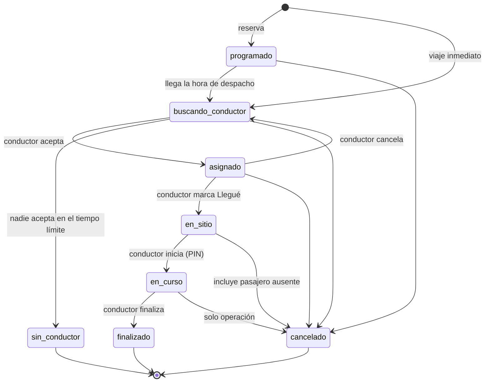
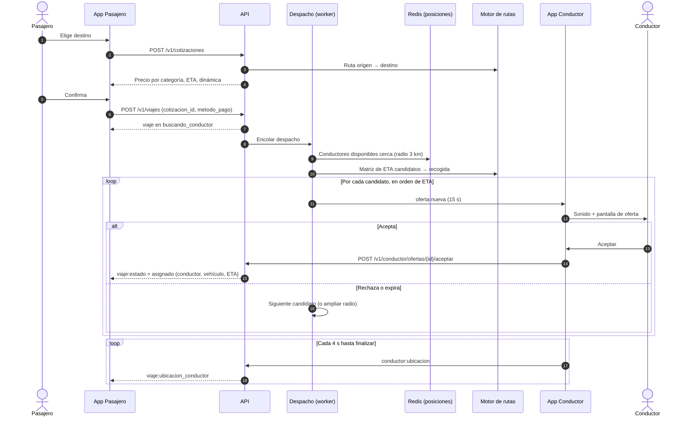
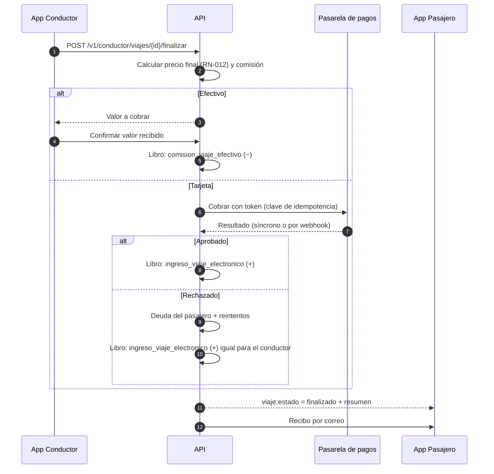
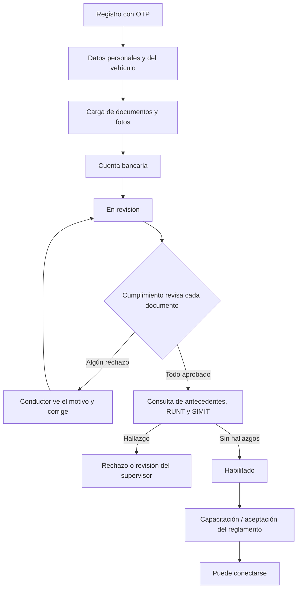
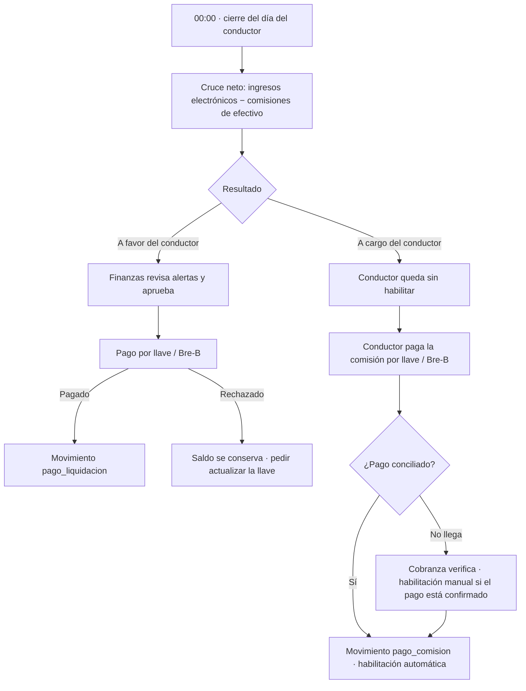
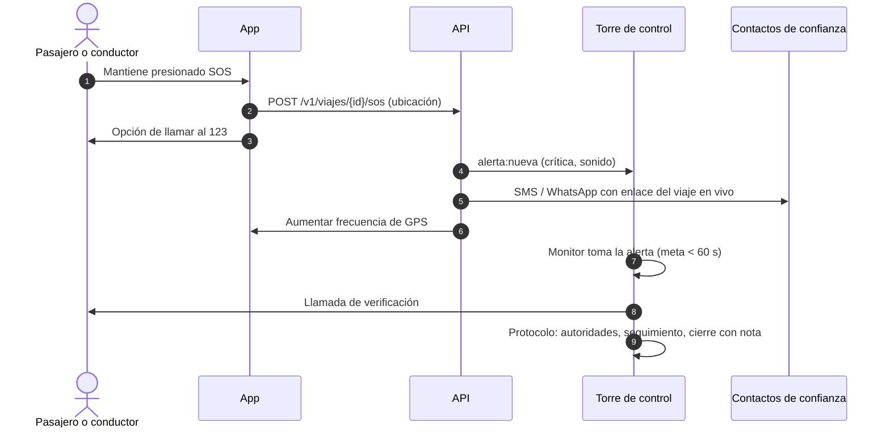
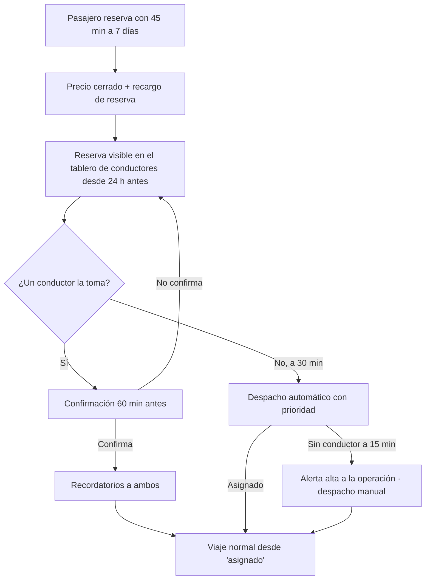

# 07 · Flujos principales

## 1. Ciclo de vida del viaje

El **estado del viaje** y el **estado del pago** se manejan por separado: un viaje puede estar
`finalizado` con el pago `pendiente` o `fallido`.

| Estado del pago | Significado |
|---|---|
| `no_aplica` | Viaje cancelado sin costo o sin conductor |
| `pendiente` | Esperando cobro o confirmación del pasajero |
| `preautorizado` | Monto reservado en la tarjeta (si la pasarela lo permite) |
| `pagado` | Cobro exitoso o efectivo confirmado por el conductor |
| `fallido` | Cobro rechazado; se convierte en deuda del pasajero |
| `reembolsado_parcial` / `reembolsado` | Se devolvió parte o todo el valor |

Cada transición genera un **evento** (`viaje_evento`) con fecha y hora, actor y datos. Esos eventos son la
fuente de la línea de tiempo y de los [indicadores de tiempos](06-app-operacion.md#ope-03--tiempos-y-movimientos).

## 2. Solicitud y asignación de un viaje inmediato

Puntos clave:

- La aceptación es **atómica**: si dos procesos intentan asignar el mismo viaje o el mismo conductor, solo
  uno gana (bloqueo en Redis + restricción en base de datos).
- Si el pasajero cancela mientras hay una oferta abierta, la oferta se retira (`oferta:retirada`).

## 3. Finalización y pago

## 4. Habilitación de un conductor

En el MVP las consultas de antecedentes, RUNT y SIMIT las hace el analista manualmente en los portales
oficiales y adjunta el soporte. La automatización con un proveedor se evalúa en F2.

## 5. Cierre diario y cobro de la comisión

## 6. Botón SOS

## 7. Viaje programado

Una reserva es un viaje en estado `programado` con `programado_para`; sigue siendo `inmediato` o `intermunicipal` en
su tipo de servicio. Cada 30 s una tarea la mantiene: la **activa** (`buscando_conductor`) a la hora de despacho, la
**libera** si su conductor no confirmó a tiempo y **alerta** si a `[15 min]` sigue sin conductor.

