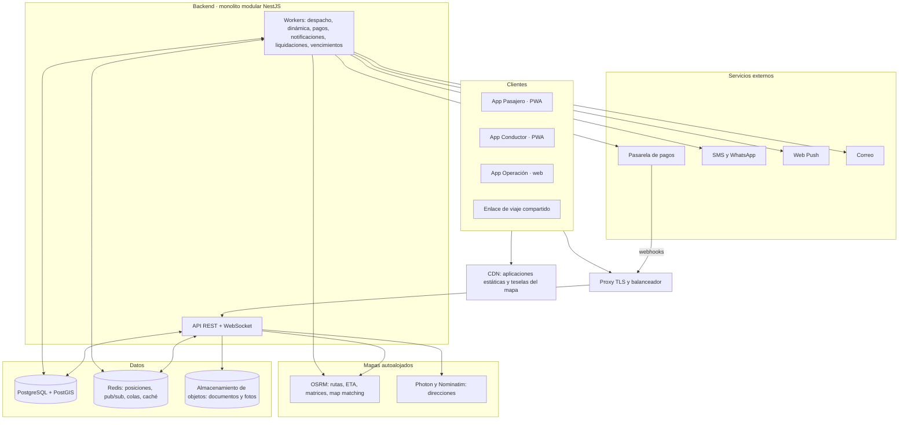
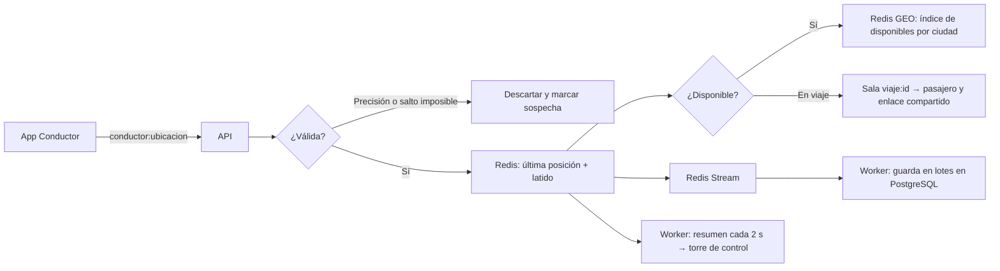

# 08 · Arquitectura

## Principios

1. **Monolito modular primero.** Un solo backend desplegable, dividido en módulos con fronteras claras.
   Se separan servicios solo cuando la carga lo justifique (ver [ADR-0001](adr/0001-monorepo-typescript-y-monolito-modular.md)).
2. **El servidor es la fuente de verdad.** El WebSocket avisa que algo cambió; ante cualquier duda
   (reconexión, app reabierta) el cliente consulta el estado actual por REST.
3. **Todo cambio de estado es un evento guardado.** Así se reconstruye cualquier viaje y se calculan los tiempos.
4. **El dinero va en un libro inmutable.** Saldos y liquidaciones salen de sumar movimientos, nunca de editar totales.
5. **Proveedores externos detrás de interfaces.** Pagos, mapas, SMS y correo se pueden cambiar sin tocar el dominio.
6. **Clientes tolerantes a mala conexión.** Reintentos idempotentes, reconexión automática y envío diferido de ubicaciones.

## Vista general



La API y los workers son **el mismo código** con distinto punto de entrada, lo que permite escalarlos por separado.

## Módulos del backend

| Módulo | Responsabilidad |
|---|---|
| `identidad` | OTP, sesiones, tokens, usuarios internos, roles y doble factor |
| `pasajeros` | Perfil, lugares guardados, contactos de confianza, deudas |
| `conductores` | Perfil, vehículos, documentos, habilitación, suspensiones |
| `tarifas` | Tarifas versionadas, recargos, festivos, zonas, rutas fijas, peajes, dinámica y cotización |
| `viajes` | Máquina de estados del viaje y registro de eventos |
| `despacho` | Búsqueda de candidatos, ofertas, tiempos de espera, ampliación de radio, despacho manual |
| `ubicacion` | Recepción de posiciones, estado operativo, detección de `sin_senal`, alertas geográficas |
| `pagos` | Métodos de pago, cobros, webhooks, reintentos, reembolsos |
| `saldos` | Libro de movimientos, cierres diarios, pagos por llave / Bre-B, cobranza y habilitación |
| `corporativo` | Empresas, contratos, empleados, centros de costo, políticas, estados de cuenta |
| `soporte` | Tickets, PQRS, objetos perdidos, SLA |
| `seguridad` | SOS, viaje compartido, PIN de inicio |
| `notificaciones` | Push, SMS, WhatsApp, correo y plantillas |
| `reportes` | Indicadores de tiempos y movimientos, exportaciones |
| `auditoria` | Registro de acciones sensibles |

Reglas entre módulos:

- Un módulo **no lee ni escribe tablas de otro**; usa su servicio público o reacciona a sus eventos internos.
- Los módulos `ubicacion` y `despacho` son los primeros candidatos a separarse si la carga crece.

## Tiempo real

- **Socket.IO** sobre WebSocket con **adaptador de Redis** para poder tener varias instancias de la API.
  Autenticación con el token JWT al conectar.
- **Salas:** `viaje:{id}`, `pasajero:{id}`, `conductor:{id}`, `operacion:{ciudad}`.
- Los eventos están en [API y tiempo real](10-api-y-tiempo-real.md#eventos-websocket).

### Recorrido de una ubicación del conductor



- **Validación:** se descartan posiciones con precisión peor a `[100 m]` o saltos físicamente imposibles
  (señal de GPS falso).
- **Torre de control:** recibe un **resumen por ciudad cada `[2 s]`**, no cada posición individual.
- **Volumen estimado:** 500 conductores enviando cada 4–10 s ≈ 50–125 mensajes por segundo; a 10× ≈ 1.250 por segundo,
  manejable con pocas instancias de la API.
- **Persistencia:** la tabla de posiciones se **particiona por día**. Al finalizar un viaje se guarda además su
  trayectoria ajustada al mapa. Retención de posiciones detalladas: `[6 meses]`, pendiente de validación legal.

## Geoespacial

| Necesidad | Herramienta |
|---|---|
| Conductores disponibles más cercanos | Redis GEO (`GEOSEARCH`) |
| ETA real de varios candidatos a la recogida | OSRM `table` |
| Ruta y precio estimado | OSRM `route` |
| Distancia real recorrida | OSRM `match` sobre la trayectoria GPS |
| Ajustar el punto de recogida a la vía | OSRM `nearest` |
| Zonas, geocercas, área de servicio, peajes | PostGIS |
| Oferta, demanda, dinámica, mapas de calor | Celdas H3 (`h3-js`) |

## Mapas con OpenStreetMap

Decisión y riesgos en [ADR-0002](adr/0002-mapas-openstreetmap-autoalojado.md). Resumen:

- **Datos:** extracto de Colombia de OpenStreetMap (Geofabrik), actualizado `[mensualmente]`.
- **Mapa base:** teselas vectoriales en un único archivo **PMTiles** servido desde almacenamiento de objetos y CDN;
  se dibujan con **MapLibre GL JS** en las tres aplicaciones.
- **Rutas y tiempos:** **OSRM** con perfil de automóvil.
- **Búsqueda de direcciones:** **Photon** (autocompletado), **Nominatim** (de coordenadas a dirección) y una
  **capa propia** con:
  - un intérprete de la **nomenclatura colombiana** (`Calle 45 # 12-30`, `Cra. 7 Bis # 32-16 Sur`) que ubica la
    dirección sobre la vía y la placa;
  - lugares curados por la operación (aeropuertos, terminales, centros comerciales, clínicas, universidades);
  - direcciones confirmadas por los pasajeros (cuando ajustan el pin y completan viajes).
  Si nada coincide, el pasajero ubica el pin en el mapa.
- Todo se usa a través de las interfaces `ProveedorRutas` y `ProveedorGeocodificacion`.

## Aplicaciones cliente

| Elemento | Elección |
|---|---|
| Lenguaje y framework | TypeScript + **React** |
| Empaquetado | **Vite** + `vite-plugin-pwa` (Workbox) para *service worker* y manifiesto |
| Estado del servidor | TanStack Query |
| Estado local | Zustand |
| Tiempo real | Cliente de Socket.IO desde `@transportaya/sdk` |
| Mapas | MapLibre GL JS |
| Estilos | Tailwind CSS con un tema compartido |
| Formularios y validación | React Hook Form + Zod (esquemas compartidos con el backend) |
| Formato | `Intl` con configuración regional `es-CO` (`$ 12.500`, `dd/mm/aaaa`) |

Las tres apps son SPA autenticadas que no necesitan SEO, por eso se usa Vite en lugar de Next.js.
Un sitio público de mercadeo, si se necesita, sería un proyecto aparte.

## Backend

| Elemento | Elección |
|---|---|
| Framework | **NestJS** (REST + gateway WebSocket) |
| Base de datos | **PostgreSQL 16+** con **PostGIS** |
| Acceso a datos | **Drizzle ORM** y migraciones; SQL explícito para consultas geoespaciales |
| Validación | Zod (`nestjs-zod`), esquemas compartidos en `@transportaya/dominio` |
| Colas y tareas programadas | **BullMQ** sobre Redis |
| Documentación de la API | OpenAPI generado desde el código |
| Autenticación | JWT de corta duración `[15 min]` + *refresh token* rotativo; TOTP para usuarios internos |

## Estructura del repositorio

Monorepo con **pnpm workspaces** y **Turborepo**:

```text
transportaya/
├── apps/
│   ├── pasajero/        # PWA de pasajeros (React + Vite)
│   ├── conductor/       # PWA de conductores (React + Vite)
│   ├── operacion/       # App web de operación (React + Vite)
│   └── api/             # Backend NestJS: API, WebSocket y workers
├── packages/
│   ├── dominio/         # Tipos, enums, máquinas de estado, esquemas Zod y cálculo de tarifas
│   ├── db/              # Esquema de PostgreSQL + PostGIS (Drizzle), migraciones, carga inicial y pruebas de integridad
│   ├── sdk/             # Cliente tipado de la API REST y del WebSocket
│   ├── ui/              # Componentes y tema compartidos
│   ├── mapas/           # Componentes de MapLibre y utilidades geográficas
│   └── config/          # Configuración compartida de TypeScript, ESLint y Tailwind
├── infra/
│   ├── docker/          # Docker Compose para desarrollo local
│   └── mapas/           # Scripts para generar PMTiles, OSRM y Photon desde el extracto de OSM
└── docs/
```

El cálculo de tarifas vive en `packages/dominio` para que la cotización del backend y las vistas previas de
la App Operación (simulador) usen exactamente la misma lógica.

## Infraestructura y entornos

- **Contenedores Docker** para la API, los workers y los servicios de mapas.
- **Servicios administrados** en la nube para PostgreSQL, Redis y almacenamiento de objetos.
  La región se elige midiendo latencia desde Colombia y validando las reglas de **transferencia
  internacional de datos** de la Ley 1581 (ver [RNF](11-requisitos-no-funcionales.md)).
- **Entornos:** local (Docker Compose con PostGIS, Redis, OSRM, Photon, almacenamiento compatible con S3
  y un buzón de correo de prueba), *staging* con datos ficticios, y producción.
- **CI/CD con GitHub Actions:** lint, verificación de tipos, pruebas y build en cada PR; despliegue automático
  a *staging* al integrar en `main`; a producción con aprobación manual.
- **Observabilidad:** logs JSON con identificador de correlación, trazas OpenTelemetry, métricas técnicas y de
  negocio en tableros, captura de errores en frontends y backend, y monitoreo de disponibilidad.
