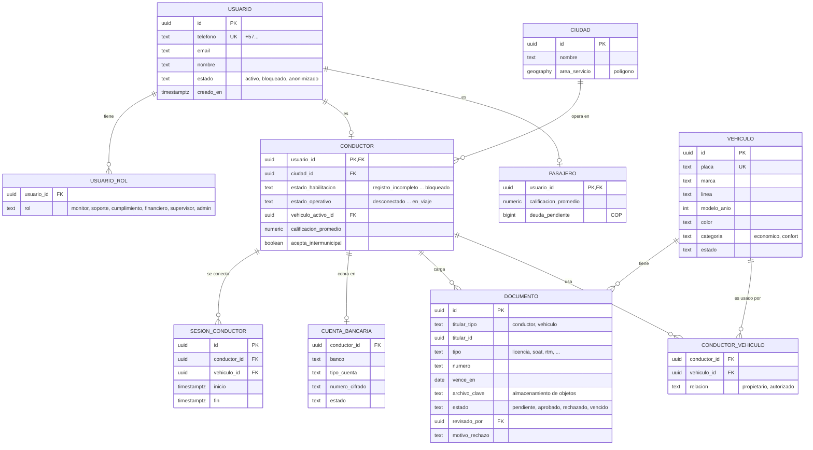
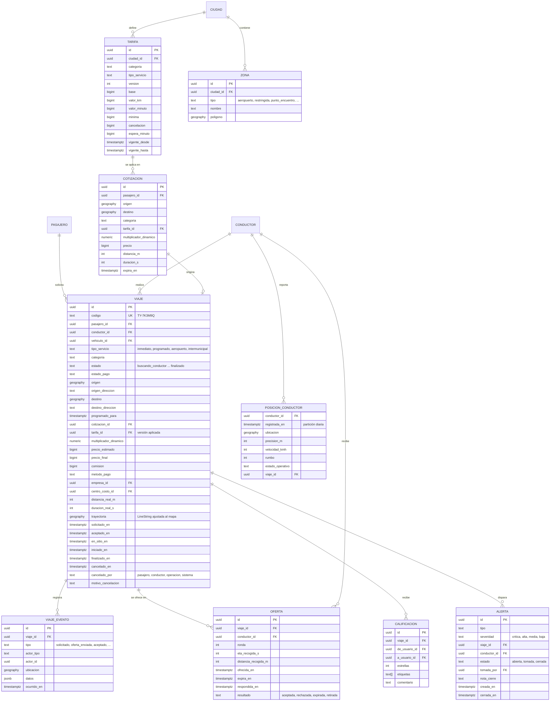
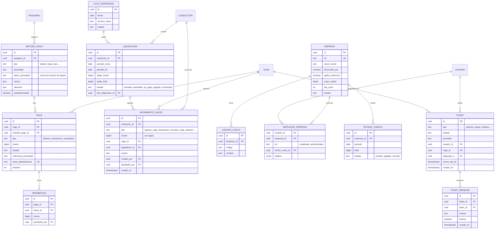

# 09 · Modelo de datos

Modelo **inicial** de las entidades principales. Sirve para alinear al equipo; los nombres exactos de
columnas e índices se definen en las migraciones.

## Convenciones

- **Identificadores:** UUID v7 (ordenables por fecha). Los viajes tienen además un **código corto** legible
  para soporte, por ejemplo `TY-7K3M9Q`.
- **Dinero:** `bigint` en pesos colombianos. Nunca `float`.
- **Fechas:** `timestamptz` guardadas en UTC; se muestran en `America/Bogota`.
- **Geografía:** PostGIS `geography` SRID 4326. Puntos para ubicaciones, polígonos para zonas y
  `LineString` para trayectorias.
- **Enumeraciones:** definidas una sola vez en `packages/dominio` y reflejadas en la base de datos.
- **Borrado de cuentas:** se **anonimizan** los datos personales y se conservan los viajes y movimientos
  por obligaciones contables y legales.

## Personas y vehículos

## Viajes, despacho y ubicación

## Pagos, saldos, corporativo y soporte

## Auditoría

Tabla `auditoria` independiente, de solo inserción:

| Columna | Descripción |
|---|---|
| `id` | UUID v7 |
| `usuario_id` | Quién hizo la acción |
| `accion` | Por ejemplo `tarifa.publicar`, `conductor.suspender`, `saldo.ajustar` |
| `entidad`, `entidad_id` | Registro afectado |
| `antes`, `despues` | `jsonb` con los valores anteriores y nuevos |
| `motivo` | Texto obligatorio en acciones sensibles |
| `ip`, `ocurrido_en` | Contexto |

## Índices y consideraciones clave

- `viaje (estado)` parcial para viajes activos; `viaje (conductor_id, solicitado_en)` y `viaje (pasajero_id, solicitado_en)`.
- Índices **GiST** en todas las columnas `geography`.
- **Una sola oferta activa por conductor** y **un solo conductor por viaje**: restricciones únicas parciales
  (además del bloqueo en Redis).
- `movimiento_saldo (conductor_id, creado_en)`; el saldo actual se guarda también en una vista materializada
  o columna calculada, siempre reconciliable con la suma del libro.
- `posicion_conductor` particionada por día; las particiones viejas se eliminan según la política de retención.
