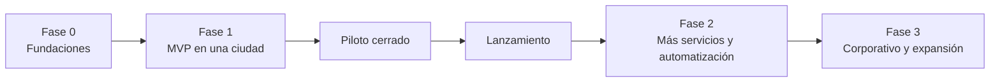

# 12 · Hoja de ruta

Las fases se definen por **alcance**, no por fechas. Las estimaciones de tiempo se harán cuando se conozca
el tamaño del equipo y se cierren las decisiones críticas de la [lista de pendientes](13-decisiones-pendientes-y-riesgos.md).

## Fase 0 · Fundaciones

**Objetivo:** cerrar lo que bloquea el desarrollo y dejar lista la base técnica.

- Concepto legal sobre el modelo de operación (D-01) y requisitos de documentos para conductores.
- Cierre de las decisiones abiertas ([D-15, D-18 a D-21](13-decisiones-pendientes-y-riesgos.md#decisiones-que-siguen-abiertas)), validación de la tabla de tarifas y del catálogo de vehículos, y modelo de margen de Wompi frente a la comisión del 3 % (R-12).
- Diseño UX/UI de los flujos críticos de las tres apps y prueba con usuarios reales (conductores incluidos).
- Monorepo, CI/CD, entornos local y *staging*.
- Servicios de mapas para la ciudad de lanzamiento: PMTiles, OSRM, Photon y **prueba de calidad de búsqueda
  de direcciones** con un set de direcciones reales (ver [ADR-0002](adr/0002-mapas-openstreetmap-autoalojado.md)).
- **Prueba técnica de la PWA del conductor** en teléfonos Android de gama baja y media: ubicación continua,
  pantalla activa, sonido de ofertas, consumo de batería y datos (ver [ADR-0003](adr/0003-app-conductor-como-pwa.md)).
- Autenticación con OTP y usuarios internos con doble factor.

**Criterio de salida:** decisiones críticas cerradas y prueba de PWA del conductor con resultado aceptable.

### Avance de la Fase 0

| Tarea | Estado |
|---|---|
| Monorepo (pnpm + Turborepo), TypeScript, ESLint y Prettier | Hecho |
| CI en GitHub Actions: formato, lint, tipos, pruebas y build | Hecho (se ejecuta al abrir un PR) |
| Entorno local con Docker Compose (PostGIS, Redis, MinIO, Mailpit) | Hecho (configuración validada; no se levantó en esta sesión) |
| Paquete `dominio`: estados del viaje, tarifa, comisión 3 % / 5 %, cierre diario | Hecho, con 45 pruebas |
| API NestJS base con `/v1/salud` y simulador de tarifa | Hecho |
| Esqueleto de las tres PWA con manifiesto y *service worker* | Hecho |
| Herramienta de la prueba técnica de la PWA del conductor (ADR-0003) | Herramienta lista; **falta ejecutarla en celulares Android reales** |
| Tarifas urbanas de Manizales (Decreto 0641 de 2025) | Hecho en el dominio, con pruebas. Quedan abiertas D-19, D-22 y D-23 |
| Esquema de base de datos y migraciones | Pendiente |
| Autenticación con OTP y usuarios internos con doble factor | Pendiente |
| Servicios de mapas (PMTiles, OSRM, Photon) y prueba de direcciones | Pendiente |
| Diseño UX/UI de los flujos críticos | Pendiente |
| Concepto legal, modelo de margen de Wompi y elección de nube | Pendiente (no es trabajo de código) |

## Fase 1 · MVP

**Objetivo:** operar viajes inmediatos y nacionales desde Manizales, con control total desde la torre de control 24/7.

| Área | Alcance |
|---|---|
| Pasajero | Registro, cotización, viaje inmediato e intermunicipal con tarifa fija, seguimiento, chat, compartir, SOS, PIN, calificación, propina, recibos, historial, soporte básico |
| Conductor | Registro con catálogo de vehículos y documentos, conexión, ofertas, navegación, estados del viaje, cobro en efectivo, cierre diario con bloqueo por deuda, indicadores |
| Operación | Torre de control con alertas, detalle de viaje con línea de tiempo y recorrido, despacho manual, onboarding y documentos, tarifas y zonas, dinámica manual, cierre diario, pagos por llave / Bre-B y cobranza, soporte básico, usuarios y auditoría |
| Pagos | Efectivo y tarjeta |
| Backend | Despacho automático, libro de movimientos, alertas automáticas, notificaciones push, SMS y correo |

**Piloto cerrado:** `[30–50]` conductores y pasajeros invitados durante `[2–4]` semanas, para ajustar
parámetros (radios, tiempos, tarifas) y validar la PWA en condiciones reales.

**Criterio de salida:** metas de [visión y alcance](01-vision-y-alcance.md#métricas-de-éxito) alcanzadas en el piloto
y prueba de penetración sin hallazgos críticos abiertos.

## Fase 2 · Más servicios y automatización

- Viajes programados y tablero de reservas.
- Rutas con tarifa por categoría, tarifas desde otras ciudades y peajes.
- Métodos de pago locales y pago de la comisión desde la app del conductor con habilitación automática.
- Dinámica automática por celdas H3.
- PQRS completo con SLA, plantillas y reembolsos con niveles de aprobación.
- Paradas intermedias, cambio de destino y llamada enmascarada.
- Pico y placa en el despacho.
- Reportes completos de tiempos y movimientos, exportables.
- Verificación de identidad del conductor con selfie al conectarse.
- Automatización de consultas de antecedentes, RUNT y SIMIT con un proveedor.

## Fase 3 · Corporativo y expansión

- Cuentas corporativas: empresas, contratos, empleados, centros de costo, políticas y estados de cuenta.
- Rol de administrador corporativo (usuario externo con acceso limitado a su empresa) dentro de la App Operación.
- Integración con el proveedor de facturación electrónica de las comisiones y de las cuentas corporativas (D-02).
- Nuevas ciudades.
- Evaluación de app nativa (Capacitor) para conductores según los datos del piloto.
