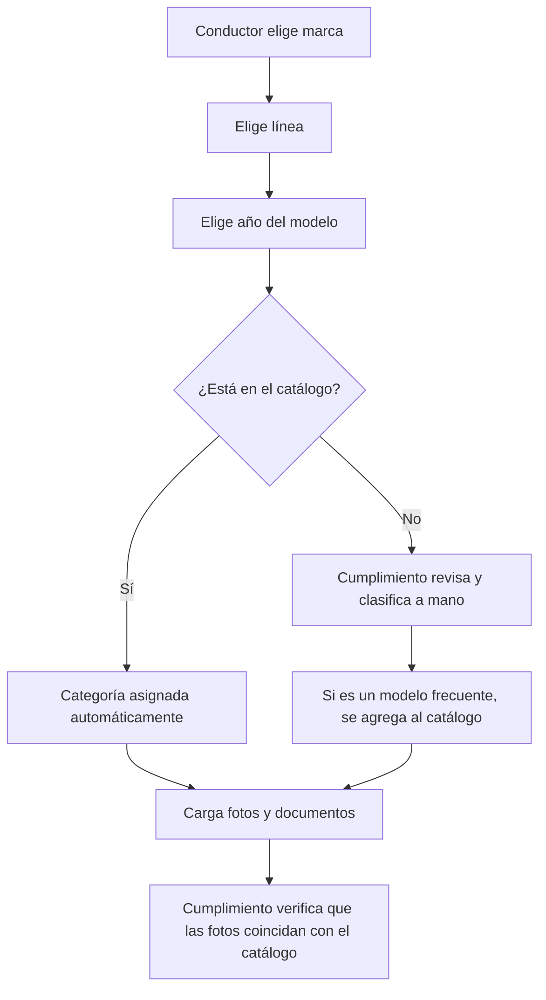

# 14 · Catálogo de vehículos y categorías

Resuelve [D-07](13-decisiones-pendientes-y-riesgos.md): el servicio tiene tres categorías, **Media**, **Media Alta**
y **Alta**, definidas según los vehículos que circulan en Colombia. En el registro, el conductor elige su vehículo
de un catálogo y la categoría se asigna automáticamente.

> **Estado: borrador.** La clasificación inicial ([`datos/catalogo-vehiculos.csv`](datos/catalogo-vehiculos.csv),
> 65 líneas) se armó por segmento de mercado y sin un criterio de precio definido. Negocio debe validarla (D-21).

## Criterio de clasificación propuesto

| Categoría | Qué incluye | Ejemplos del borrador |
|---|---|---|
| **Media** | Hatchback y sedán compactos de entrada | Chevrolet Spark GT, Onix, Sail; Renault Kwid, Logan; Kia Picanto, Rio; Nissan March, Versa |
| **Media Alta** | Sedán de gama media y SUV compactos | Mazda 3, Toyota Corolla, Kia Cerato, Hyundai Elantra; Renault Duster, Chevrolet Tracker, Hyundai Creta |
| **Alta** | SUV grandes y sedán de gama alta o premium | Toyota Fortuner, Prado, Camry; Mazda CX-5, Hyundai Tucson, Kia Sportage; Mercedes-Benz, BMW, Audi |

Pendiente decidir con Negocio: si además del segmento se usa un **valor comercial de referencia** (por ejemplo,
la guía de valores de Fasecolda) con umbrales de precio para cada categoría, y cómo se tratan los modelos nuevos
o los que cambian de segmento con los años.

## Cómo se usa en el registro del conductor

- El catálogo se **muestra con fotos de referencia** para que el conductor reconozca su vehículo.
- La categoría asignada la puede **corregir cumplimiento** (por ejemplo, por estado del vehículo o equipamiento), con motivo y auditoría.
- Un vehículo de **categoría superior** puede atender viajes de una categoría inferior si el conductor lo activa (RN-003).
- Los requisitos de antigüedad no aplican (D-14); el estado del vehículo lo verifican la **revisión técnico-mecánica** y las **fotos**.

## Datos que guarda cada línea del catálogo

| Campo | Descripción |
|---|---|
| `marca`, `linea` | Por ejemplo, Chevrolet / Onix |
| `anio_desde`, `anio_hasta` | Años del modelo a los que aplica la clasificación; permite que una línea cambie de categoría entre generaciones |
| `carroceria` | Hatchback, sedán, SUV, van... |
| `pasajeros`, `puertas` | Capacidad y puertas |
| `categoria` | `media`, `media_alta` o `alta` |
| `foto_referencia` | Imagen que se muestra al conductor |
| `activo` | Permite retirar una línea sin borrar los vehículos ya registrados |

La administración del catálogo (alta, edición y retiro de líneas) es un módulo de la [App Operación](06-app-operacion.md#ope-04--conductores-y-vehículos),
accesible para los roles de cumplimiento y administrador.
